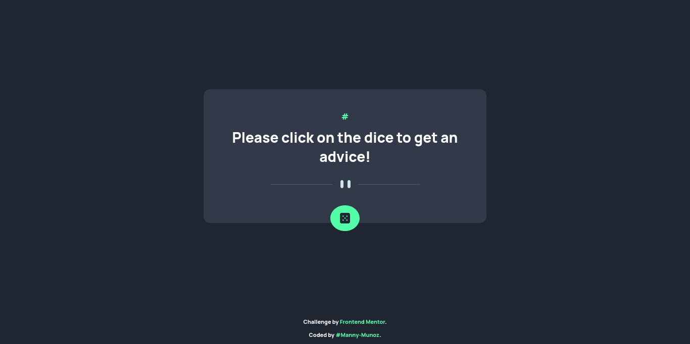

# Frontend Mentor - Advice generator app solution

This is a solution to the [Advice generator app challenge on Frontend Mentor](https://www.frontendmentor.io/challenges/advice-generator-app-QdUG-13db). Frontend Mentor challenges help you improve your coding skills by building realistic projects.

## Table of contents

- [Overview](#overview)
  - [Screenshot](#screenshot)
  - [Links](#links)
- [My process](#my-process)
  - [Built with](#built-with)
- [Author](#author)

## Overview

### Screenshot



### Links

- Solution URL: [frontendmentor.io/solutions/advice-generator-app-solution-using-vanilla-javascript-IYnKtIamX7](https://www.frontendmentor.io/solutions/advice-generator-app-solution-using-vanilla-javascript-IYnKtIamX7)
- Live Site URL: [manny-munoz.github.io/Advice-generator-app-Frontend-Mentor-Challenge](https://manny-munoz.github.io/Advice-generator-app-Frontend-Mentor-Challenge/)

## My process

### Built with

- Semantic HTML5 markup
- CSS custom properties
- Flexbox
- CSS Grid
- Mobile-first workflow
- vanilla javascript

###What I Learned

I learned that if we need to fetch a document in order to make the firefox version to work, we need to add a no-cache request

```js
fetch(url, {cache: "no-cache"} )
```

### Useful resources

- [Cache-control](https://developer.mozilla.org/en-US/docs/Web/CSS/@media/hover) - This helps me to understand the no-cache request 

## Author

- Frontend Mentor - [@Manny-Munoz](https://www.frontendmentor.io/profile/Manny-Munoz)


